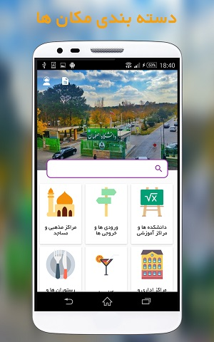
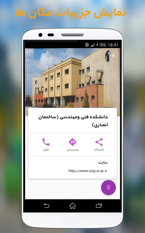

 
<h1 align="center"> isfahanUniversity </h1>
 

    

#### `Introduce`

The application of Isfahan University locator has been developed for locating and getting acquainted with different centers of Isfahan University for the students of this university.

#### `Features`
* Show educational, service, welfare places and… University of Isfahan on the map
* Get phone number, website address, pictures and complete information of university locations
* Routing from the user's current location to the selected location.

#### `Screenshot` 

  
   
   
   
   
  

  

 
  
### `Tools & Dependencies`
* MVP Structure
* Google Maps
* Google Material Design
* Retrofit- Network Requests
* Dagger- Dependency Injection
* RxJava/RxAndroid- Reacttive Programming
* Firebase Crashlytics

 

[Show Demo Video](https://drive.google.com/file/d/193PONFCxdWDl9c0wrbsLojrL-PFImHxr/view?usp=sharing)

[Download Demo apk](https://github.com/OmidTaheri/isfahanUniversity/blob/master/Apks/IsfUni.apk)

